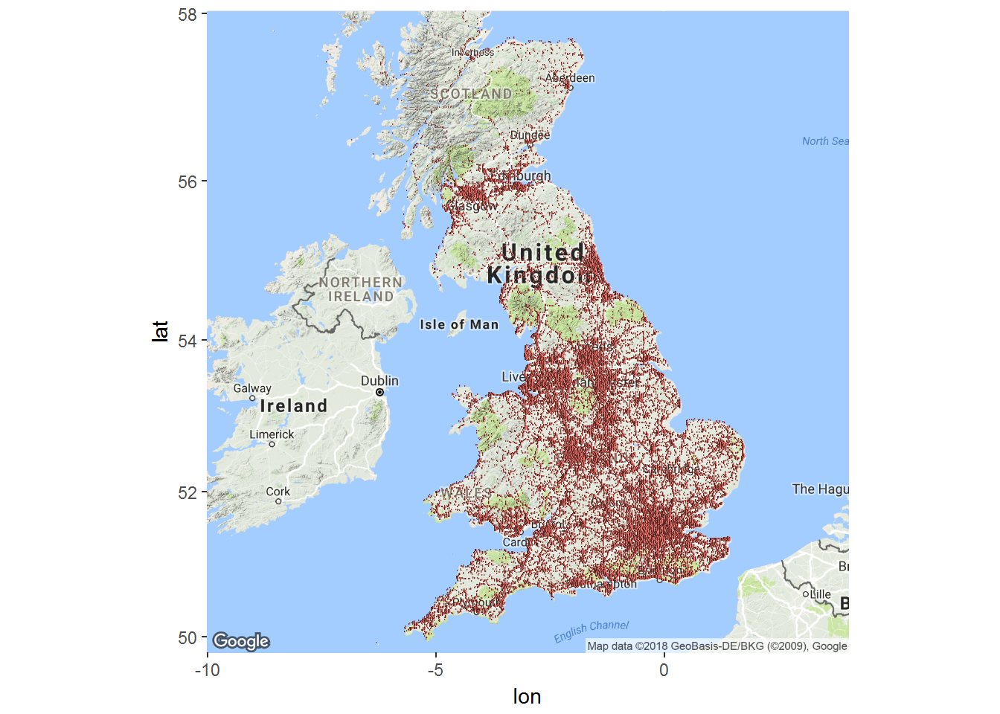
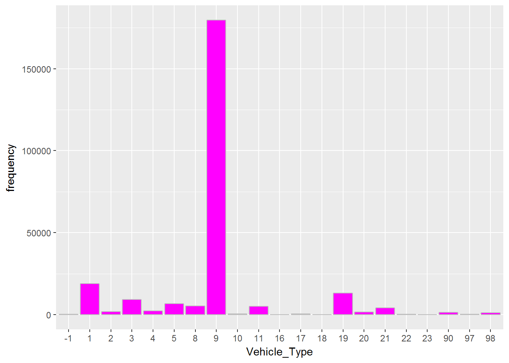

# Analysis of UK Accident Data
Gangesh Dubey  
February 5, 2018  


Load Required packages, I used dplr for data wrangling and both ,ggmap and leaflet, for visulaization                           

```r
library(dplyr)
```

```
## 
## Attaching package: 'dplyr'
```

```
## The following objects are masked from 'package:stats':
## 
##     filter, lag
```

```
## The following objects are masked from 'package:base':
## 
##     intersect, setdiff, setequal, union
```

```r
library(leaflet)
library(ggmap)
```

```
## Loading required package: ggplot2
```
Now let us read files exported from the DB, please note these files are preprocessed and cleaned for messy data


```r
df_accidents <- read.csv("exported_accidents2016.csv",stringsAsFactors = FALSE)
df_makemodel <- read.csv("exported_makemodel2016.csv",stringsAsFactors = FALSE)

df_lat_long <- as.data.frame(cbind(lat=df_accidents$Latitude_2dec,lon=df_accidents$Longitude_2dec))
df_group_by_lon_lat <- df_lat_long %>%  group_by_(.dots=c("lon","lat")) %>% summarize(number=n())%>%arrange(desc(number))
```
below code will create a high-level heatmap of accident prone areas

```r
uk_map <- get_map(location = c(lon = -3, lat = 54.116667), zoom = 6, maptype = "terrain", scale = 2)
```

```
## Map from URL : http://maps.googleapis.com/maps/api/staticmap?center=54.116667,-3&zoom=6&size=640x640&scale=2&maptype=terrain&language=en-EN&sensor=false
```

```r
ggmap(uk_map) +  geom_point(data = df_lat_long, aes(x = lon, y = lat, fill = "red", alpha = 0.8), size = 0.05, shape = 21) +guides(fill=FALSE, alpha=FALSE, size=FALSE)
```

```
## Warning: Removed 120 rows containing missing values (geom_point).
```

<!-- -->
Another approach to identify accident prone areas at a much granular level

```r
accidents_map_lg <- leaflet(data = df_group_by_lon_lat[c(1:1000),c("lon","lat")]) %>% setView(-3,54.116667, zoom = 6) %>% addTiles() %>%
  addMarkers(~lon,~lat,clusterOptions = markerClusterOptions())
accidents_map_lg
```

<!--html_preserve--><div id="htmlwidget-9d94c8d340d3310f13ef" style="width:672px;height:480px;" class="leaflet html-widget"></div>
<script type="application/json" data-for="htmlwidget-9d94c8d340d3310f13ef">{"x":{"options":{"crs":{"crsClass":"L.CRS.EPSG3857","code":null,"proj4def":null,"projectedBounds":null,"options":{}}},"setView":[[54.116667,-3],6,[]],"calls":[{"method":"addTiles","args":["//{s}.tile.openstreetmap.org/{z}/{x}/{y}.png",null,null,{"minZoom":0,"maxZoom":18,"maxNativeZoom":null,"tileSize":256,"subdomains":"abc","errorTileUrl":"","tms":false,"continuousWorld":false,"noWrap":false,"zoomOffset":0,"zoomReverse":false,"opacity":1,"zIndex":null,"unloadInvisibleTiles":null,"updateWhenIdle":null,"detectRetina":false,"reuseTiles":false,"attribution":"&copy; <a href=\"http://openstreetmap.org\">OpenStreetMap<\/a> contributors, <a href=\"http://creativecommons.org/licenses/by-sa/2.0/\">CC-BY-SA<\/a>"}]},{"method":"addMarkers","args":[[51.51,51.52,51.52,51.51,51.52,51.51,51.54,51.51,51.52,51.5,51.51,51.53,55.95,51.5,51.51,51.52,51.53,51.51,51.48,51.5,51.52,50.82,51.52,51.46,51.52,51.49,51.56,51.53,51.51,51.52,51.53,51.51,51.52,51.52,51.53,51.54,51.52,55.86,51.5,51.55,51.59,51.47,51.52,51.43,51.57,54.97,51.47,53.8,51.47,51.59,51.51,51.53,51.39,51.46,51.49,51.56,51.51,51.49,51.49,51.51,51.58,51.51,51.52,51.43,51.88,51.48,51.47,51.51,51.49,51.52,51.56,51.45,51.46,51.48,51.49,51.5,51.37,54.97,51.47,51.49,51.48,51.49,51.49,51.55,51.49,51.56,52.47,52.58,51.51,51.52,51.49,51.6,51.55,51.51,51.51,50.83,51.46,53.75,51.51,51.48,51.5,51.49,51.5,51.55,51.54,51.45,52.96,51.46,52.95,51.57,51.58,51.53,51.47,53.82,53.81,53.37,51.51,51.54,51.5,51.53,51.55,51.56,51.27,51.46,53.8,51.57,51.55,51.49,51.46,51.55,51.58,51.53,51.38,55.86,53.75,51.61,51.47,51.46,51.52,51.46,51.49,51.44,51.45,51.44,51.38,51.52,51.59,51.55,52.48,53.74,51.42,51.56,51.59,51.54,51.54,52.2,51.45,53.48,52.47,50.91,52.63,52.64,51.49,51.55,51.51,51.48,51.46,51.6,51.57,53.8,51.75,51.66,51.53,51.49,51.59,51.51,51.46,51.48,51.5,51.48,51.61,51.5,51.61,51.47,51.6,51.44,52.47,52.43,51.56,51.47,51.54,51.61,51.55,51.57,51.55,51.44,51.47,51.53,51.55,51.54,51.51,51.53,51.51,51.52,51.53,53.41,53.65,53.39,53.52,50.84,51.47,51.55,50.83,51.53,51.48,51.44,52.48,53.8,53.8,53.79,52.96,52.95,51.51,51.53,51.53,51.5,51.43,51.45,51.5,51.48,51.52,51.54,55.87,55.95,52.47,52.46,52.47,52.49,52.64,50.8,50.81,51.51,51.49,51.58,51.46,50.83,51.47,51.47,51.41,51.56,51.52,51.54,52.2,55.94,54.05,52.59,52.92,51.24,51.88,51.5,51.4,51.44,51.61,53.57,51.48,51.49,51.61,51.47,51.53,51.58,51.53,51.57,50.77,53.77,52.46,53.96,52.24,52.14,51.49,51.58,51.52,51.54,51.54,51.4,51.58,51.52,51.55,51.53,52.63,55.86,52.47,53.8,53.38,53.38,51.89,51.54,51.5,50.83,51.59,51.62,51.46,51.53,51.49,51.54,55.95,53.4,53.44,53.68,52.91,50.91,52.13,51.67,51.47,53.76,51.54,51.47,51.42,50.82,51.45,51.4,51.44,51.57,51.57,51.39,54.89,52.48,52.81,53.81,53.37,50.83,53.23,51.51,51.6,50.83,51.4,51.51,51.48,51.6,51.62,51.68,51.43,51.57,51.58,51.49,51.59,51.45,51.13,53.65,53.49,53.87,52.46,53.79,53.79,53.8,53.81,52.9,52.92,51.75,52.97,52.63,53.53,50.8,52.91,51.32,51.54,51.58,51.49,51.55,51.52,51.56,51.5,51.42,51.43,51.44,51.39,51.54,51.43,51.49,51.48,51.52,51.55,51.53,51.55,51.58,51.54,51.38,52.06,50.37,50.37,53.76,53.72,53.82,52.41,53.55,53.23,51.87,52.97,53.52,52.63,53.96,52.23,51.51,51.45,51.52,51.55,51.53,51.53,51.55,51.54,50.82,51.56,51.55,51.48,51.56,51.44,51.52,51.58,51.45,51.57,51.55,51.53,52.63,55.84,51.62,53.82,53.39,53.65,51.46,53.39,53.76,52.49,52.51,53.79,52.41,52.63,51.44,51.5,51.5,51.44,51.54,53.75,53.75,51.51,51.49,51.49,51.52,51.46,51.53,51.53,50.84,51.36,51.42,51.46,51.63,51.65,51.41,51.52,51.5,51.56,51.56,51.89,55.96,53.47,52.49,52.8,54.53,53.81,52.96,52.96,52.65,51.48,51.44,51.55,51.45,51.49,51.54,51.56,51.56,52.58,52.57,51.4,50.83,51.38,51.47,51.57,51.58,51.55,51.4,51.52,51.53,51.54,55.96,55.97,53.19,53.76,51.46,52.49,52.48,52.5,52.48,53.81,53.69,50.85,52.63,50.81,51.22,51.52,51.52,51.51,51.32,51.48,51.5,51.53,51.48,51.51,51.53,51.49,52.59,51.51,51.61,51.41,51.55,51.58,51.37,51.55,51.47,51.49,51.44,51.54,51.49,51.53,51.58,51.54,51.55,51.39,51.49,53.41,53.41,53.76,51.46,53.75,52.19,53.84,52.58,52.5,52.53,50.74,52.46,53.81,52.41,53.41,53.01,52.64,52.63,50.82,51.45,51.75,51.5,51.49,50.81,51.41,51.51,51.51,51.48,51.51,51.53,51.5,50.82,51.57,51.45,53.56,51.53,51.44,51.48,51.71,52.98,51.58,51.13,51.61,51.3,51.27,52.61,50.37,55.94,51.48,55.96,53.41,53.44,51.45,53.75,53.09,53.04,53.03,53.62,50.72,52.45,52.49,53.81,53.79,52.42,52.44,53.41,50.9,54.91,52.95,52.61,52.64,50.85,51.31,51.65,50.83,51.48,51.51,53.74,51.47,51.39,51.41,51.46,51.41,51.55,51.56,51.46,51.55,51.59,51.42,51.42,51.47,51.47,51.38,51.39,51.47,51.6,51.4,51.57,51.5,51.56,51.65,53.56,51.43,51.43,51.55,51.49,51.45,51.53,51.57,51.49,51.44,51.42,50.86,51.54,51.08,52.64,55.87,55.86,50.38,53.81,53.4,53.4,51.47,53.75,52.58,53.87,52.48,52.46,53.79,52.43,53.39,50.92,54.57,52.77,52.97,52.97,52.98,52.95,50.79,51.45,52.24,52.24,51.25,51.52,51.51,51.25,51.51,51.47,51.65,51.54,51.48,51.54,53.77,51.33,51.45,51.55,51.39,51.55,51.57,51.59,51.6,51.65,53.57,51.4,51.41,51.42,51.52,51.57,52.2,51.58,51.73,52.06,51.34,55.85,50.38,54.11,53.41,54.89,53.57,53.77,53.77,51.47,50.61,51.9,52.57,52.42,52.5,52.45,52.44,52.47,52.53,51.56,51.56,53.69,54.97,53.82,54.9,52.41,52.92,52.92,50.92,53.36,50.91,50.93,50.7,52.6,50.81,50.79,50.8,51.46,51.25,51.25,51.44,51.43,51.89,51.88,51.87,51.52,51.58,51.75,53.77,51.54,51.55,51.95,51.37,51.56,51.59,51.12,51.55,51.59,51.61,51.46,51.54,51.57,51.44,53.57,51.38,51.4,51.64,51.46,51.59,51.59,51.48,51.41,51.54,51.54,51.49,51.58,51.59,52.21,51.42,51.43,51.08,55.84,50.47,55.93,55.95,51.13,53.4,53.41,53.75,53.58,53.59,53.79,53.48,52.99,52.41,52.51,52.46,52.52,50.72,52.51,50.72,50.73,52.5,52.52,51.07,53.81,53.8,53.8,54.98,53.8,53.77,53.79,53.99,52.42,53.68,54.99,50.9,53,53.14,52.96,53,53.51,51.45,50.83,51.63,51.44,51.49,51.47,53.76,51.48,51.59,51.51,51.47,51.57,51.38,51.59,51.4,51.47,52.58,51.47,51.55,51.36,51.41,51.65,51.44,51.42,50.84,51.36,51.61,51.57,50.84,51.57,51.58,51.61,51.36,53.55,51.54,51.44,51.67,51.48,51.44,51.45,51.53,51.56,51.57,51.56,51.55,51.43,51.19,51.5,50.77,51.37,51.09,52.61,55.84,55.85,51.49,55.96,53.8,53.42,53.4,51.44,53.39,51.44,51.86,53.01,52.59,52.98,52.48,52.69,52.51,52.44,52.51,52.44,52.47,52.43,51.58,53.8,54.95,54.96,53.78,52.28,53.4,52.46,53.39,52.9,51.76,52.66,53.08,52,53.59,51.24,52.14,51.89,51.53,51.89,51.9,51.48,53.74,51.57,53.73,51.46,51.6,51.5,51.59,51.62,53.77,51.47,51.58,51.57,51.59,51.55,51.61,51.45,51.49,51.5,51.69,51.48,51.36,51.42,51.46,51.37,51.43,51.45,51.6,51.24,51.27,51.61,51.6,50.82,51.54,51.44,51.56,53.57,51.68,51.69,51.59,51.45,51.46,51.59,51.46,51.47,51.6,51.53,51.45,51.4,52.21,51.53,53.14,51.43,51.57,51.39,51.38,51.28,51.26,51.38,50.26,55.85,50.48,51.48,55.9,53.83,53.39,53.28,53.47,51.46,51.46,53.38,53.73,52.71,53.48,53.51],[-0.13,-0.08,-0.17,-0.14,-0.07,-0.09,-0.14,-0.15,-0.14,-0.11,-0.1,-0.06,-3.19,-0.15,-0.12,-0.1,-0.08,-0.16,-0.11,-0.1,-0.15,-0.14,-0.11,-0.12,-0.12,-0.1,-0.12,-0.09,-0.08,-0.16,-0.11,-0.01,-0.19,-0.13,-0.12,-0.1,-0.06,-4.26,-0.22,-0.08,-0.07,-0.09,-0.05,-0.13,-0.07,-1.61,-0.02,-1.54,-0.12,-0.1,-0.07,-0.13,-0.11,-0.01,-0.13,-0.07,-0.38,-0.22,-0.19,-0.11,-0.07,-0.06,0.06,-0.17,-0.42,-0.19,-0.07,-0.05,-0.2,-0.2,-0.06,-0.02,-0.22,-0.18,-0.17,-0.13,-0.1,-1.62,-0.11,-0.11,-0.09,-0.09,-0.18,-0.11,-0.08,0.07,-1.88,-0.24,-0.23,-0.21,-0.15,-0.11,-0.06,-0.04,-0.02,-0.14,-0.11,-2.49,-0.2,-0.17,-0.16,-0.12,-0.12,-0.07,0,-2.59,-1.15,-2.58,-1.15,-0.1,-0.1,-0.07,-0.06,-3.05,-1.52,-1.48,-0.25,-0.25,-0.17,-0.14,-0.14,-0.1,0.52,-2.59,-1.55,-0.23,-0.19,-0.14,-0.13,-0.09,-0.08,-0.03,0.53,-4.27,-0.35,-0.28,-0.21,-0.19,-0.18,-0.17,-0.16,-0.13,-0.12,-0.11,-0.1,-0.09,-0.06,-0.04,-1.89,-0.36,-0.13,-0.11,-0.11,-0.06,0.07,0.13,-2.6,-2.24,-1.87,-1.4,-1.13,-1.13,-0.25,-0.24,-0.22,-0.2,-0.14,-0.07,-1.78,-1.53,-1.24,-0.4,-0.35,-0.21,-0.2,-0.19,-0.16,-0.15,-0.14,-0.12,-0.11,-0.08,-0.07,-0.03,-0.02,0.37,-1.9,-1.5,-0.25,-0.15,-0.08,-0.06,-0.05,-0.01,0.03,0.24,-0.17,-0.17,-0.13,-0.09,-0.03,-0.02,0,0.02,0.04,-2.98,-1.78,-1.46,-1.13,-1.07,-0.36,-0.3,-0.13,-0.1,-0.07,-0.02,-1.9,-1.78,-1.76,-1.75,-1.17,-1.14,-0.32,-0.29,-0.2,-0.19,-0.16,-0.15,-0.09,-0.03,-0.03,0.01,-4.27,-3.2,-1.92,-1.89,-1.86,-1.83,-1.12,-1.08,-1.08,-0.24,-0.23,-0.22,-0.18,-0.17,-0.16,-0.13,-0.12,-0.01,0.01,0.03,0.12,-3.18,-2.8,-2.13,-1.47,-0.58,-0.41,-0.18,-0.16,-0.15,-0.09,-0.07,-0.06,-0.05,-0.05,-0.04,-0.04,0.04,0.06,0.18,0.29,-2.71,-1.87,-1.09,-0.9,-0.47,-0.27,-0.24,-0.22,-0.19,-0.15,-0.1,-0.03,0.03,0.06,0.09,1.29,-4.25,-1.89,-1.56,-1.48,-1.47,-0.43,-0.26,-0.24,-0.15,-0.09,-0.09,-0.07,-0.01,0.01,0.04,-3.21,-2.98,-2.97,-1.5,-1.48,-1.41,-0.47,-0.4,-0.37,-0.35,-0.2,-0.19,-0.16,-0.13,-0.13,-0.12,-0.12,-0.09,0.01,1.39,-2.93,-1.88,-1.64,-1.56,-1.47,-1.07,-0.54,-0.27,-0.27,-0.18,-0.17,-0.17,-0.13,-0.1,-0.06,-0.05,-0.04,-0.02,0,0.07,0.21,0.24,1.31,-3,-2.95,-1.91,-1.88,-1.77,-1.74,-1.59,-1.51,-1.48,-1.48,-1.26,-1.17,-1.14,-1.13,-1.09,-0.64,-0.56,-0.39,-0.33,-0.29,-0.26,-0.23,-0.22,-0.21,-0.18,-0.18,-0.16,-0.12,-0.12,-0.1,-0.07,-0.05,-0.04,0.01,0.05,0.05,0.12,0.15,0.52,1.14,-4.15,-4.14,-2.7,-1.86,-1.52,-1.5,-1.48,-1.42,-1.2,-1.15,-1.14,-1.11,-1.08,-0.9,-0.59,-0.41,-0.41,-0.37,-0.24,-0.22,-0.22,-0.18,-0.15,-0.14,-0.12,-0.1,-0.09,-0.05,-0.02,-0.02,0.01,0.02,0.07,0.11,1.3,-4.26,-3.94,-3.04,-3.03,-2.63,-2.61,-2.59,-2.47,-1.9,-1.83,-1.76,-1.49,-1.15,-0.5,-0.45,-0.41,-0.38,-0.38,-0.36,-0.33,-0.31,-0.3,-0.28,-0.26,-0.21,-0.19,-0.18,-0.12,-0.12,-0.08,-0.08,-0.06,-0.06,-0.03,-0.01,0,0.08,0.15,0.9,-3.18,-2.24,-1.89,-1.64,-1.55,-1.53,-1.19,-1.18,-1.12,-0.41,-0.39,-0.34,-0.33,-0.31,-0.3,-0.29,-0.28,-0.25,-0.24,-0.19,-0.16,-0.11,-0.05,-0.03,-0.01,0,0.02,0.07,0.07,0.71,-3.2,-3.17,-2.89,-2.71,-2.57,-1.94,-1.91,-1.9,-1.85,-1.57,-1.31,-1.18,-1.1,-1.06,-0.78,-0.72,-0.65,-0.6,-0.45,-0.4,-0.38,-0.37,-0.33,-0.33,-0.33,-0.26,-0.25,-0.18,-0.18,-0.16,-0.15,-0.15,-0.12,-0.1,-0.08,-0.04,-0.03,-0.01,0.02,0.03,0.07,0.08,0.08,1.38,-3.16,-2.97,-2.95,-2.69,-2.55,-2.37,-2.22,-2.21,-2.13,-1.93,-1.9,-1.88,-1.86,-1.55,-1.52,-1.4,-1.19,-1.14,-1.12,-1.08,-0.98,-0.47,-0.43,-0.41,-0.37,-0.31,-0.29,-0.28,-0.21,-0.21,-0.21,-0.2,-0.12,-0.11,-0.1,-0.08,-0.05,-0.04,-0.04,-0.04,-0.02,0.14,0.26,0.26,0.51,0.53,1.72,-4.13,-3.2,-3.17,-3.17,-2.99,-2.93,-2.58,-2.48,-2.44,-2.19,-2.17,-2.16,-1.87,-1.82,-1.82,-1.58,-1.54,-1.49,-1.48,-1.45,-1.4,-1.38,-1.17,-1.12,-1.1,-1.07,-0.75,-0.39,-0.37,-0.37,-0.34,-0.34,-0.33,-0.3,-0.3,-0.3,-0.29,-0.29,-0.26,-0.24,-0.23,-0.22,-0.2,-0.19,-0.18,-0.14,-0.12,-0.1,-0.1,-0.09,-0.08,-0.06,-0.05,-0.05,-0.05,-0.03,-0.02,-0.01,0.04,0.09,0.12,0.17,0.19,0.27,0.36,0.38,0.58,0.72,1.17,1.29,-4.26,-4.21,-4.13,-3.05,-2.99,-2.97,-2.58,-2.45,-1.99,-1.9,-1.86,-1.82,-1.57,-1.49,-1.47,-1.4,-1.24,-1.21,-1.19,-1.16,-1.15,-1.13,-1.08,-0.96,-0.89,-0.88,-0.77,-0.62,-0.61,-0.59,-0.58,-0.42,-0.41,-0.37,-0.36,-0.35,-0.35,-0.27,-0.21,-0.21,-0.19,-0.18,-0.08,-0.08,-0.08,-0.08,-0.08,-0.07,-0.05,0,0.04,0.08,0.14,0.18,0.48,1.15,1.41,-4.28,-4.14,-3.23,-2.94,-2.92,-2.89,-2.68,-2.67,-2.59,-2.46,-2.07,-2,-1.97,-1.92,-1.87,-1.85,-1.85,-1.84,-1.78,-1.77,-1.63,-1.6,-1.58,-1.54,-1.51,-1.5,-1.49,-1.46,-1.45,-1.42,-1.39,-1.29,-1.18,-1.09,-1.07,-1.06,-0.97,-0.58,-0.57,-0.53,-0.47,-0.45,-0.43,-0.42,-0.4,-0.34,-0.34,-0.33,-0.28,-0.28,-0.28,-0.23,-0.21,-0.21,-0.19,-0.16,-0.16,-0.16,-0.15,-0.13,-0.12,-0.1,-0.1,-0.09,-0.09,-0.05,-0.04,-0.04,-0.03,-0.02,0.02,0.02,0.05,0.06,0.06,0.08,0.12,0.23,0.37,1.18,-4.42,-3.54,-3.21,-3.18,-3,-2.96,-2.9,-2.46,-2.43,-2.3,-2.24,-2.23,-2.14,-1.97,-1.94,-1.91,-1.9,-1.89,-1.89,-1.88,-1.87,-1.87,-1.84,-1.79,-1.77,-1.75,-1.71,-1.61,-1.58,-1.55,-1.55,-1.54,-1.52,-1.49,-1.43,-1.38,-1.2,-1.2,-1.16,-1.14,-1.14,-0.97,-0.78,-0.75,-0.54,-0.52,-0.38,-0.36,-0.32,-0.31,-0.3,-0.29,-0.29,-0.28,-0.28,-0.24,-0.24,-0.22,-0.2,-0.2,-0.19,-0.19,-0.19,-0.18,-0.17,-0.15,-0.15,-0.15,-0.14,-0.13,-0.13,-0.12,-0.12,-0.1,-0.09,-0.07,-0.06,-0.04,-0.01,0,0,0.08,0.1,0.11,0.12,0.14,0.24,0.27,0.27,0.28,0.55,1.18,1.73,-4.27,-4.26,-3.17,-3.16,-3.05,-2.92,-2.9,-2.6,-2.6,-2.56,-2.24,-2.18,-2.14,-2.1,-2.04,-2.03,-1.99,-1.98,-1.95,-1.94,-1.91,-1.89,-1.73,-1.72,-1.6,-1.6,-1.56,-1.53,-1.5,-1.49,-1.48,-1.47,-1.2,-1.12,-0.81,-0.73,-0.65,-0.6,-0.48,-0.46,-0.45,-0.44,-0.44,-0.39,-0.39,-0.37,-0.37,-0.33,-0.3,-0.29,-0.29,-0.29,-0.29,-0.28,-0.28,-0.27,-0.26,-0.25,-0.25,-0.24,-0.24,-0.23,-0.23,-0.22,-0.21,-0.21,-0.2,-0.19,-0.19,-0.19,-0.19,-0.17,-0.15,-0.14,-0.12,-0.11,-0.11,-0.09,-0.08,-0.06,-0.03,-0.03,-0.02,-0.01,0,0,0.01,0.01,0.01,0.02,0.03,0.11,0.11,0.15,0.34,0.35,0.49,0.5,0.51,0.52,0.53,0.54,-5.05,-4.32,-3.55,-3.2,-3.09,-3.03,-2.96,-2.9,-2.63,-2.6,-2.56,-2.56,-2.49,-2.47,-2.25,-2.24],null,null,null,{"clickable":true,"draggable":false,"keyboard":true,"title":"","alt":"","zIndexOffset":0,"opacity":1,"riseOnHover":false,"riseOffset":250},null,null,{"showCoverageOnHover":true,"zoomToBoundsOnClick":true,"spiderfyOnMaxZoom":true,"removeOutsideVisibleBounds":true,"spiderLegPolylineOptions":{"weight":1.5,"color":"#222","opacity":0.5},"freezeAtZoom":false},null,null,null,null]}],"limits":{"lat":[50.26,55.97],"lng":[-5.05,1.73]}},"evals":[],"jsHooks":[]}</script><!--/html_preserve-->

Let us analyse what kind of vehicles are generally involved in an accident, cars obviously top the list but pedal cycle is a surprsing second !

```r
df_ref_vehicle_type <- data.frame(Vehicle_Type= c(1:5,8:11,16:23,90,97,98,-1),
                               Vehicle_Type_Desc = c("Pedal cycle","Motorcycle 50cc and under","Motorcycle 125cc and under","Motorcycle over 125cc and up to 500cc","Motorcycle over 500cc","Taxi/Private hire car","Car","Minibus 8 - 16 passenger seats","Bus or coach 17 or more pass seats","Ridden horse","Agricultural vehicle","Tram","Van / Goods 3.5 tonnes mgw or under","Goods over 3.5t. and under 7.5t","Goods 7.5 tonnes mgw and over","Mobility scooter","Electric motorcycle","Other vehicle","Motorcycle- unknown cc","Goods vehicle - unknown weight","Data missing or out of range"))

df_makemodel$Vehicle_Type <-as.factor(df_makemodel$Vehicle_Type)
df_ref_vehicle_type$Vehicle_Type <- as.factor(df_ref_vehicle_type$Vehicle_Type)

df_group_by_vehicle_type <- df_makemodel%>% group_by(Vehicle_Type) %>% summarise(frequency = n())%>% arrange(desc(frequency)) %>% inner_join(df_ref_vehicle_type,by="Vehicle_Type")
df_group_by_vehicle_type
```

```
## # A tibble: 21 x 3
##    Vehicle_Type frequency                     Vehicle_Type_Desc
##          <fctr>     <int>                                <fctr>
##  1            9    179615                                   Car
##  2            1     19047                           Pedal cycle
##  3           19     13125   Van / Goods 3.5 tonnes mgw or under
##  4            3      9152            Motorcycle 125cc and under
##  5            5      6704                 Motorcycle over 500cc
##  6            8      5234                 Taxi/Private hire car
##  7           11      4998    Bus or coach 17 or more pass seats
##  8           21      4262         Goods 7.5 tonnes mgw and over
##  9            4      2232 Motorcycle over 125cc and up to 500cc
## 10            2      1907             Motorcycle 50cc and under
## # ... with 11 more rows
```

```r
ggplot(data=df_group_by_vehicle_type,aes(x=Vehicle_Type,y=frequency))+geom_bar(stat="identity",fill="Magenta",colour="grey")
```

<!-- -->
